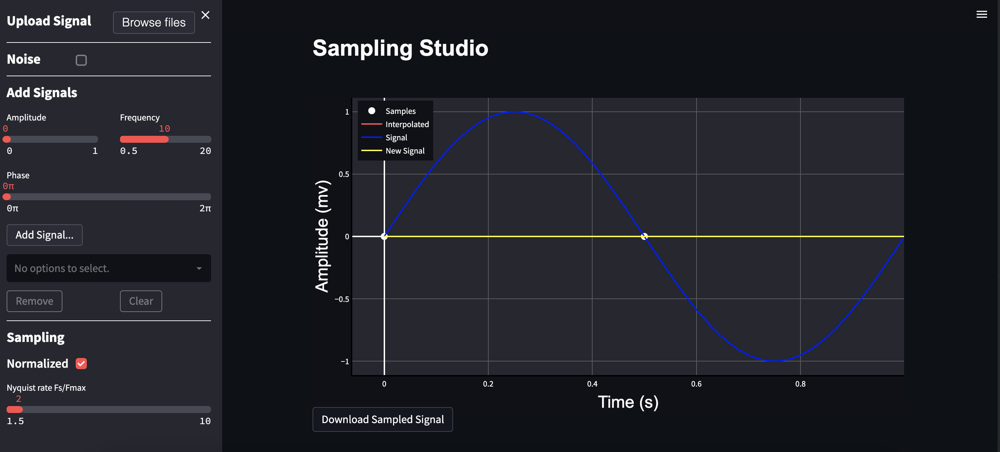
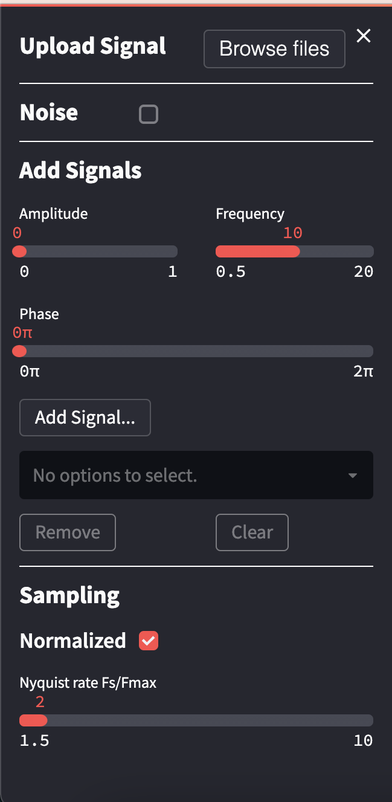
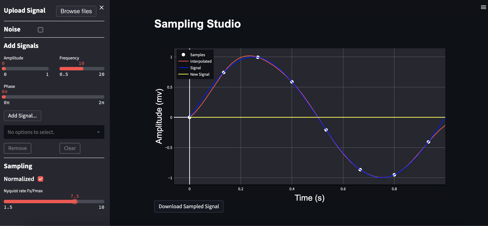
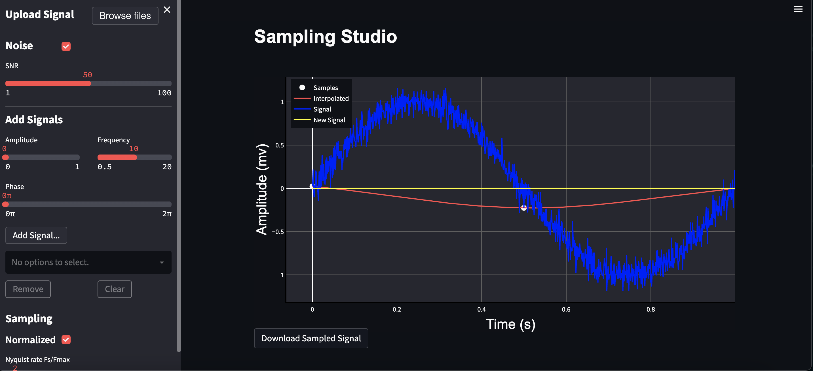

# Sampling studio

A web application that illustrates the signal sampling and recovery showing the importance and
validation of the Nyquist rate.

## Table of Contents

- [Built with](#Built-with)
- [Deployment](#Deployment)
- [Design](#Design)
- [Features](#Features)
- [Authors](#Authors)


## Built with


## Deployment

 Install streamlit

```bash
  pip install streamlit
```
Install used modules

```bash
requirements-txt init
```
To start deployment 
```bash
  streamlit run streamlit_app.py
```

## 🖌️ Design


* **side bar**



## Features
* **Sampling**



* **Add signal**


* **Add noise**


* **Download your signal**


## 🔗 Authors
- Abram Gad. sec(1)  BN(1)
-  [@abram1111](https://github.com/Abram1111)
[](https://www.linkedin.com/in/abram-gad-hanna/)

- Esraa Ali. sec(1)  BN(12)
- [@Esraa-alii](https://github.com/Esraa-alii)
[](https://www.linkedin.com/in/esraa-ali-2754a61b0/)

- Dina Khaled  sec(1)  BN(31)
- [@dina-khalid](https://github.com/dina-khalid)
[](https://www.linkedin.com/in/dina-salama-5758101b4/)

- Sherif Ahmed  sec(1) BN(47)
- [@Sherif-2001](https://github.com/Sherif-2001)
[](https://www.linkedin.com/mwlite/in/sherif-ahmed-elsayed)


