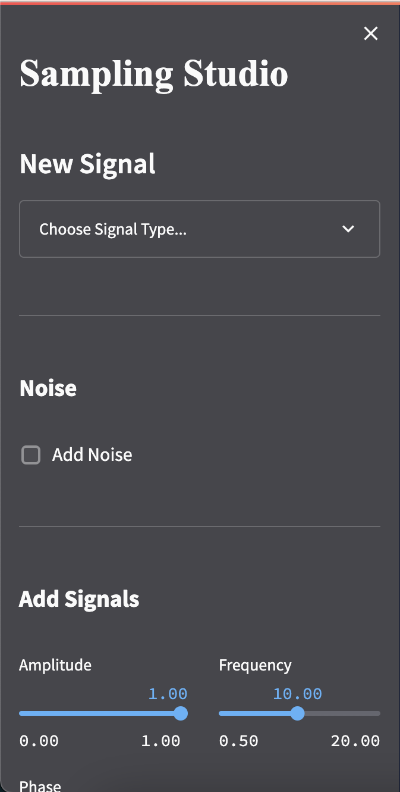
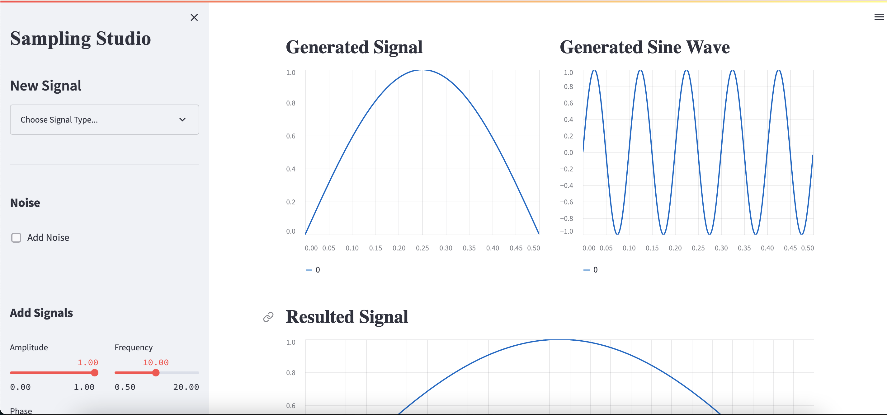
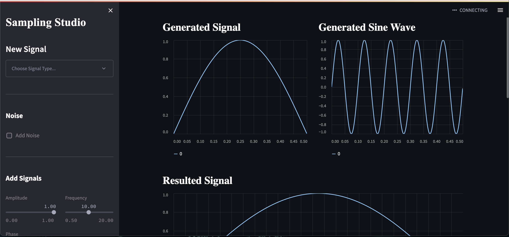
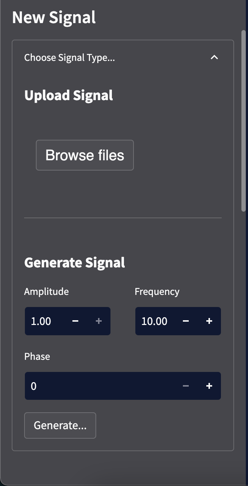
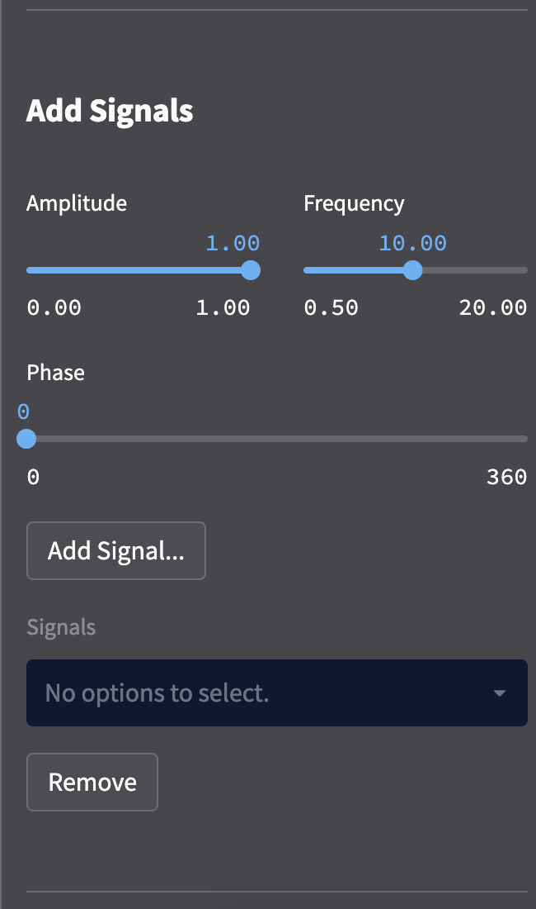
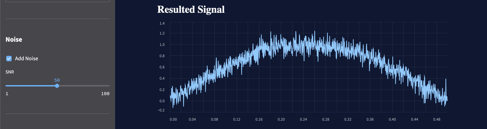
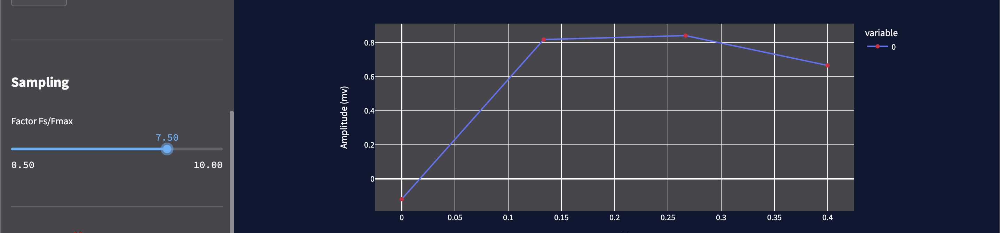
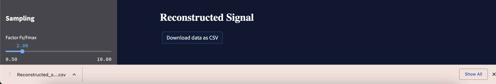

# Sampling studio

A web application that illustrates the signal sampling and recovery showing the importance and
validation of the Nyquist rate.

## Table of Contents

- [Built with](#Built-with)
- [Deployment](#Deployment)
- [Design](#Design)
- [Features](#Features)
- [Authors](#Authors)


## Built with


## Deployment

 Install streamlit

```bash
  pip install streamlit
```
Install used modules

```bash
  pip install pandas
```
```bash
  pip install sampling_studio_functions
```
```bash
  pip install streamlit_modal
```
```bash
  pip install numpy
```
To start deployment 
```bash
  streamlit run streamlit_app.py
```


## 🖌️ Design


* **side bar**

| Sidebar up | sidebar buttom |
|--|--|
|||

 * **Themes**
 
| Light Mood | Dark Mood |
|--|--|
|||


## Features
| upload or generate signal | signal or remove signal |
|--|--|
|||

| Add noise using SNR |
|----|
||

| Sampling signal and interpolate using Sinc interpolation |
|----|
||

| Download Sufnal as CSV |
|----|
||

 


## 🔗 Authors
- [@abram1111](https://github.com/Abram1111)
[](https://www.linkedin.com/in/abram-gad-hanna/)

- [@Esraa-alii](https://github.com/Esraa-alii)
[](https://www.linkedin.com/in/esraa-ali-2754a61b0/)

- [@dina-khalid](https://github.com/dina-khalid)
[](https://www.linkedin.com/in/dina-salama-5758101b4/)

- [@Sherif-2001](https://github.com/Sherif-2001)
[](https://www.linkedin.com/mwlite/in/sherif-ahmed-elsayed)


